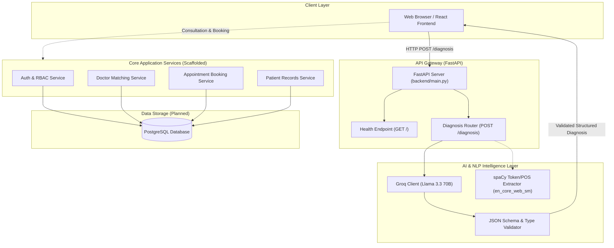

<div align="center">

# 🩺 MediConnect

### *Next-Generation AI Healthcare Triage & Clinical Consultation Platform*

[](https://www.python.org/)
[](https://fastapi.tiangolo.com/)
[](https://groq.com/)
[](https://spacy.io/)
[](LICENSE)
[](#-project-roadmap)

<p align="center">
  <a href="#-overview">Overview</a> •
  <a href="#-system-architecture">Architecture</a> •
  <a href="#-key-features">Features</a> •
  <a href="#-tech-stack">Tech Stack</a> •
  <a href="#-repository-structure">Structure</a> •
  <a href="#-quickstart-guide">Quickstart</a> •
  <a href="#-api-documentation">API Reference</a> •
  <a href="#-security--medical-safety">Safety & Privacy</a> •
  <a href="#-project-roadmap">Roadmap</a> •
  <a href="#-faq">FAQ</a>
</p>

</div>

---

> [!WARNING]
> ### ⚠️ Clinical Disclaimer
> **MediConnect provides preliminary, automated symptom analysis strictly for educational and informational purposes.** It is **NOT** a diagnostic medical device, medical opinion, or substitute for consultation with a licensed healthcare practitioner. In the event of a medical emergency, immediately dial your local emergency services (e.g., 911, 112) or visit the nearest emergency care facility.

---

## 📖 Overview

Navigating primary healthcare often involves friction: patients struggle to interpret symptoms, experience anxiety from unguided internet searches, and face delays in securing appointments with the right medical specialists.

**MediConnect** bridges this gap by unifying **intelligent natural language symptom triage** with **clinical booking pathways**:
1. **Intelligent Intake:** Patients describe their symptoms in plain, conversational language.
2. **Dual AI/NLP Engine:** Queries the high-speed **Groq Cloud API** running `llama-3.3-70b-versatile` with strict JSON schema parsing, backed by a local **spaCy** token and rule-based fallback analyzer.
3. **Actionable Insights:** Returns structured differential possibilities, safe immediate self-care recommendations, and red-flag warning indicators.
4. **Specialist Pathway:** Seamlessly guides the patient toward verified doctors, clinic directories, and appointment booking.

---

## 🏛 System Architecture

The following diagram illustrates how user requests move through MediConnect's layered architecture:



---

## 🚀 Key Features

| Feature | Description | Status |
| :--- | :--- | :---: |
| 🧠 **LLM-Powered Symptom Triage** | Real-time clinical reasoning powered by Groq `llama-3.3-70b-versatile` with structured JSON output enforcement. | ✅ **Active** |
| 🔍 **spaCy NLP Rule Engine** | Offline-capable tokenization, POS tagging, and lemma extraction (`en_core_web_sm`) for symptom matching. | ✅ **Active** |
| 🛡️ **Robust Schema Sanitizer** | Regex sanitization, JSON code-fence stripping, and strict Pydantic model validation with 502 bad-gateway interception. | ✅ **Active** |
| 🔐 **Authentication & RBAC** | Role-Based Access Control for Patients, Doctors, and Administrators with JWT token validation. | ⏳ *Scaffolded* |
| 🏥 **Doctor & Clinic Directory** | Specialist search by department, location, rating, and disease expertise. | ⏳ *Scaffolded* |
| 📅 **Appointment Management** | Interactive scheduling, calendar conflict resolution, and status tracking (Pending, Confirmed, Completed). | ⏳ *Scaffolded* |
| 📁 **Patient Medical Dossier** | Historical symptom logs, diagnostic summaries, and prescription attachments. | ⏳ *Scaffolded* |

---

## 🛠 Tech Stack

### Backend & Core Services
- **Framework:** [FastAPI](https://fastapi.tiangolo.com/) (Asynchronous, high-performance web framework for Python 3.10+)
- **Server:** [Uvicorn](https://www.uvicorn.org/) (Lightning-fast ASGI server)
- **Validation & Serialization:** [Pydantic v2](https://docs.pydantic.dev/)
- **Configuration:** [python-dotenv](https://github.com/theskumar/python-dotenv)

### AI, Machine Learning & NLP
- **Primary LLM:** [Groq Cloud](https://console.groq.com/) running **Meta Llama 3.3 70B Versatile** (ultra-low inference latency)
- **NLP / Linguistic Engine:** [spaCy](https://spacy.io/) with the `en_core_web_sm` English linguistic model
- **Schema Validation:** Strict JSON format enforcement with regex boundary matching and type validation

### Database & Storage (Planned)
- **Relational Database:** [PostgreSQL](https://www.postgresql.org/)
- **ORM & Migrations:** [SQLAlchemy](https://www.sqlalchemy.org/) & [Alembic](https://alembic.sqlalchemy.org/)

### Frontend (Scaffolded)
- **Library:** [React.js](https://react.dev/)
- **Styling:** [Tailwind CSS](https://tailwindcss.com/)

---

## 📁 Repository Structure

The project employs a clean separation of concerns, separating application routing, business domain logic, data models, and AI engine utilities:

```text
MediConnect/
│
├── .gitignore                           # Git ignore rules (.env, venv, pycache)
├── README.md                            # Comprehensive project guide
│
├── backend/                             # Core FastAPI Backend
│   ├── main.py                          # Application entry point & router registration
│   ├── test_api.py                      # Standalone CLI test script for AI diagnosis
│   │
│   ├── ai_engine/                       # AI and NLP Processing Modules
│   │   ├── __init__.py
│   │   ├── diagnosis_engine.py          # Local spaCy tokenization & rule-based engine
│   │   ├── groq_client.py               # Groq Cloud API caller (Llama 3.3 70B)
│   │   └── prompt_templates.py          # Medical assistant prompt definitions
│   │
│   ├── config/                          # Configuration & Environment Settings
│   │   └── settings.py
│   │
│   ├── database/                        # PostgreSQL DB connection & Seeders
│   │   ├── database.py
│   │   └── seed_data.py
│   │
│   ├── models/                          # Database ORM entity models
│   │   ├── __init__.py
│   │   ├── appointment.py               # Appointment schema definition
│   │   ├── doctor.py                    # Doctor profile & clinic entity
│   │   ├── patient.py                   # Patient record entity
│   │   └── user.py                      # User auth & credentials model
│   │
│   ├── routes/                          # FastAPI route controllers
│   │   ├── __init__.py
│   │   ├── admin.py                     # Administrative actions
│   │   ├── appointments.py              # Appointment scheduling endpoints
│   │   ├── auth.py                      # Signup, login, & JWT issuance
│   │   ├── diagnosis.py                 # POST /diagnosis (AI intake endpoint)
│   │   ├── doctors.py                   # Doctor search & directory
│   │   └── patients.py                  # Patient profiles & history
│   │
│   ├── schemas/                         # Pydantic request & response schemas
│   │   ├── appointment_schema.py
│   │   ├── diagnosis_schema.py
│   │   ├── doctor_schema.py
│   │   └── patient_schema.py
│   │
│   ├── services/                        # Business logic layer
│   │   ├── appointment_service.py
│   │   ├── diagnosis_service.py
│   │   ├── doctor_service.py
│   │   └── patient_service.py
│   │
│   ├── tests/                           # Automated test suites
│   │   ├── test_api.py
│   │   ├── test_database.py
│   │   └── test_diagnosis.py
│   │
│   └── utils/                           # Shared utility helpers & validators
│       ├── helpers.py
│       └── validators.py
│
├── frontend/                            # React Web Client (Scaffolded)
│   ├── public/                          # Static web assets
│   └── src/                             # React application source
│       ├── assets/                      # Icons, illustrations, styles
│       ├── components/                  # Reusable UI components (Modals, Cards, Nav)
│       ├── hooks/                       # Custom React hooks
│       ├── pages/                       # View pages (Diagnosis, Doctors, Dashboard)
│       └── services/                    # API client layer (Axios / Fetch)
│
└── docs/                                # Architectural guides and specifications
```

---

## ⚡ Quickstart Guide

Follow these steps to set up and run the MediConnect backend locally on your system.

### 1. Prerequisites
- **Python 3.10 or higher** installed on your system
- **Git** installed
- A free **Groq Cloud API Key** from [console.groq.com](https://console.groq.com/)

### 2. Clone the Repository
```bash
git clone https://github.com/Vish-0806/MediConnect.git
cd MediConnect
```

### 3. Create & Activate Virtual Environment

**On Windows (PowerShell):**
```powershell
python -m venv venv
.\venv\Scripts\Activate.ps1
```

**On Windows (Command Prompt):**
```cmd
python -m venv venv
.\venv\Scripts\activate.bat
```

**On macOS / Linux:**
```bash
python3 -m venv venv
source venv/bin/activate
```

### 4. Install Dependencies
```bash
pip install fastapi uvicorn requests python-dotenv spacy pydantic
```

Download the spaCy linguistic model:
```bash
python -m spacy download en_core_web_sm
```

### 5. Configure Environment Variables
Create a `.env` file in the `backend/` folder (or workspace root):

```env
# Groq Cloud API Key (Required for AI Diagnosis)
GROQ_API_KEY=gsk_your_groq_api_key_here

# App Settings
PORT=8000
ENVIRONMENT=development
```

> [!TIP]
> Never commit `.env` containing your real API keys to Git. The `.gitignore` file is pre-configured to exclude `.env` automatically.

### 6. Start the Backend Server

Run Uvicorn from the `backend/` directory:
```bash
cd backend
uvicorn main:app --reload --port 8000
```
*(Or from the project root using `python -m uvicorn backend.main:app --reload --port 8000`)*

Once started, the service will be available at:
- 🌐 **Base API:** `http://localhost:8000`
- 📚 **Swagger UI:** `http://localhost:8000/docs`
- 📖 **ReDoc Documentation:** `http://localhost:8000/redoc`

---

## 🔌 API Documentation

### 1. Root / Health Check
Verifies that the FastAPI server is running.

- **Method:** `GET`
- **Path:** `/`
- **Response `200 OK`:**
  ```json
  {
    "message": "MediConnect Backend Running 🚀"
  }
  ```

---

### 2. AI Symptom Diagnosis
Evaluates conversational symptom descriptions and returns structured medical insights.

- **Method:** `POST`
- **Path:** `/diagnosis`
- **Headers:** `Content-Type: application/json`

#### Request Payload
```json
{
  "symptoms": "High fever, persistent dry cough, sore throat, and mild headache for 2 days"
}
```

#### Success Response (`200 OK`)
```json
{
  "possible_conditions": [
    "Influenza (Flu)",
    "Acute Viral Upper Respiratory Tract Infection",
    "Early Stage Acute Bronchitis"
  ],
  "recommended_actions": [
    "Rest thoroughly and increase fluid intake (water, warm soups)",
    "Track body temperature at regular 4-hour intervals",
    "Take over-the-counter antipyretics if advised by a pharmacist",
    "Schedule a clinical consultation if symptoms fail to improve in 48 hours"
  ],
  "warning_signs": [
    "Difficulty breathing or shortness of breath",
    "Persistent chest pressure or localized chest pain",
    "Fever spiking over 103°F (39.4°C) or unresponsive to fever reducers",
    "Bluish lips or confusion"
  ],
  "medical_disclaimer": "This analysis is generated by AI for informational purposes and is not a professional medical diagnosis. Please consult a licensed medical professional."
}
```

#### Response Fields Explanation
| Field | Type | Description |
| :--- | :--- | :--- |
| `possible_conditions` | `string[]` | 3 to 5 potential conditions matching the reported symptoms. |
| `recommended_actions` | `string[]` | Practical, safe, non-invasive self-care steps and hydration guidance. |
| `warning_signs` | `string[]` | Critical "red-flag" symptoms requiring immediate emergency clinical evaluation. |
| `medical_disclaimer` | `string` | Mandatory safety disclaimer informing the user this is not a definitive diagnosis. |

---

### 3. Testing with cURL & Python

#### Using cURL
```bash
curl -X POST "http://localhost:8000/diagnosis" \
     -H "Content-Type: application/json" \
     -d "{\"symptoms\": \"fever, body aches, and fatigue\"}"
```

#### Using Python
```python
import requests

url = "http://localhost:8000/diagnosis"
payload = {"symptoms": "severe migraine with sensitivity to light"}

response = requests.post(url, json=payload)
print(response.json())
```

#### Using JavaScript / Fetch
```javascript
const response = await fetch("http://localhost:8000/diagnosis", {
  method: "POST",
  headers: { "Content-Type": "application/json" },
  body: JSON.stringify({ symptoms: "persistent abdominal pain after meals" }),
});

const data = await response.json();
console.log(data);
```

---

## 🧪 Testing & Verification

MediConnect includes standalone test runners and unit test directories:

### Quick AI Engine Smoke Test
To verify that your Groq API key and AI inference are operating properly without launching the web server:
```bash
python backend/test_api.py
```

### Running Automated Test Suites (When fully configured)
```bash
pytest backend/tests/ -v
```

---

## 🔒 Security & Medical Safety

- **Zero PII Exposure to LLM:** Only non-identifiable symptom descriptions are forwarded to inference models; personal information (names, emails, addresses) is isolated in relational storage.
- **Strict Schema Enforcement:** Responses from third-party AI APIs are strictly sanitized and parsed through JSON regex validators before reaching the client, preventing prompt injection leakage or malformed responses.
- **Definitive Diagnosis Prevention:** System prompt instructions explicitly prohibit the LLM from declaring a single definitive diagnosis, enforcing differential possibilities and encouraging consultation with licensed physicians.
- **Environment Isolation:** All sensitive credentials (`GROQ_API_KEY`, database secrets) are managed exclusively through environment variables.

---

## 🗺️ Project Roadmap

- [x] **Phase 1: AI Diagnostics Foundation**
  - [x] FastAPI skeleton & modular routing architecture
  - [x] Groq Cloud client integration with `llama-3.3-70b-versatile`
  - [x] Robust JSON response extraction & error handling (502 bad gateway shields)
  - [x] spaCy fallback NLP symptom parser (`diagnosis_engine.py`)
- [ ] **Phase 2: Persistence & Data Modeling**
  - [ ] Configure PostgreSQL database connection pool (`backend/database/database.py`)
  - [ ] Implement SQLAlchemy models for Users, Doctors, Patients, Appointments
  - [ ] Setup Alembic migration pipelines
- [ ] **Phase 3: Authentication & Security**
  - [ ] JWT-based token generation, password hashing with passlib/bcrypt
  - [ ] Route authentication guards and role-based permissions (Patient vs. Doctor vs. Admin)
- [ ] **Phase 4: Doctor Discovery & Appointment Scheduling**
  - [ ] Doctor listing & department filtering API
  - [ ] Real-time time-slot reservation and booking confirmation
- [ ] **Phase 5: React Frontend Application**
  - [ ] Modern UI with Tailwind CSS
  - [ ] Interactive symptom intake form with real-time feedback
  - [ ] Diagnosis card results with red-flag warning highlights
  - [ ] Doctor booking calendar integration

---

## ❓ FAQ

<details>
<summary><b>1. Do I need a paid Groq Cloud subscription to run MediConnect?</b></summary>
No. Groq provides a generous free tier for developers with high rate limits, making it easy to test and develop with <code>llama-3.3-70b-versatile</code> at zero cost.
</details>

<details>
<summary><b>2. How does the local spaCy fallback work?</b></summary>
The <code>backend/ai_engine/diagnosis_engine.py</code> module uses spaCy's <code>en_core_web_sm</code> pipeline to filter stop words, extract parts of speech (nouns, adjectives, verbs), and lemmatize tokens to identify disease patterns locally without making any external API calls.
</details>

<details>
<summary><b>3. How can I contribute to the frontend development?</b></summary>
The frontend structure is scaffolded under <code>frontend/src/</code>. You can initialize a React/Vite app within that directory, integrate Tailwind CSS, and connect your components to the FastAPI endpoints listed in the <a href="#-api-documentation">API Documentation</a>.
</details>

---

## 🤝 Contributing

Contributions are what make the open-source community an amazing place to learn, inspire, and create. Any contributions you make are **greatly appreciated**.

1. Fork the Project
2. Create your Feature Branch (`git checkout -b feature/NewFeature`)
3. Commit your Changes (`git commit -m 'Add some NewFeature'`)
4. Push to the Branch (`git push origin feature/NewFeature`)
5. Open a Pull Request

---

## 📄 License

Distributed under the **MIT License**. See `LICENSE` for more information.

---

<div align="center">
  <sub>Built with ❤️ by <a href="https://github.com/Vish-0806">Vishal S Naik</a> and contributors.</sub>
</div>
